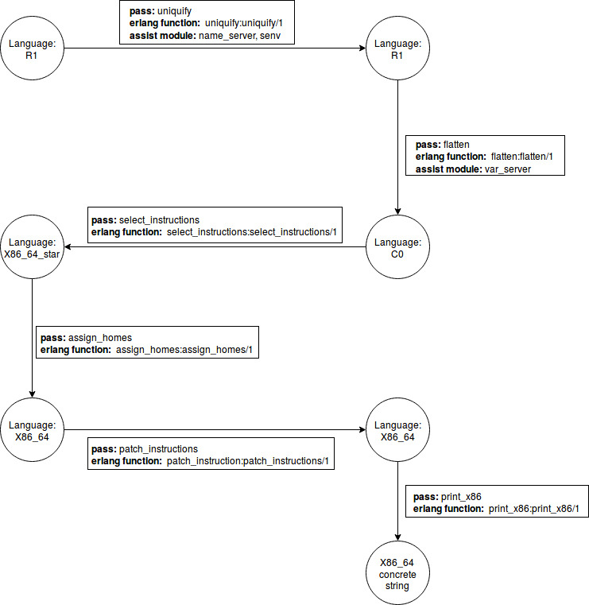

Chapter 2
==========

The code in this directory implements all the modules of Chapter 2.

## File Description

* `common.hrl`: ast type defines
* `uniquify.erl`: rename variables in the ast of R1
* `name_server`: used in `uniquify.erl` to generate new variable names
* `senv.erl`: used in `uniquify` to staticly emulator environment
* `r1.erl` and `env.erl`: a r1 interperter for R1 langauge
* `r1_tok.erl` and `r1_parse.erl`: the compiler frontend of R1
* `ast_to_src.erl`: generate source code from ast
* `random_ast`: generator random programs
* `tests.py`: python program to test
* `flatten.erl` and `var_server.erl`: the flatten pass to generate C0 language
* `c0.erl`: the interpreter for C0 language
* `select_instructions.erl`: the select_instructions pass to compile C0 to pseudo-x86(`x86_64_star`)
* `assign_homes.erl`: the assign_homes pass
* `patch_instructions.erl`: the patch_instructions pass
* `print_x86.erl`: generate final x86_64 code
* `compiler.erl`: generate machine code from scheme
* `test.erl`: full passes test

## Passes Flow Chart

